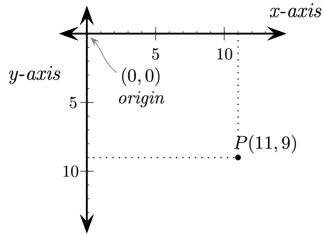
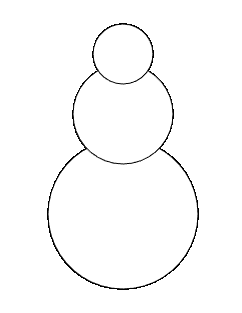
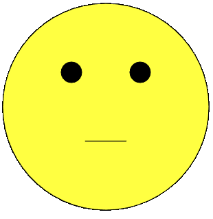

# Comandi

Useremo, in questo corso, il linguaggio di programmazione Javascript, arricchito dalle funzionalità messe a disposizione dalla libreria [https://p5js.org/](P5.JS)

Possiamo usare comandi P5.JS chiamando **funzioni** messe a disposizione da questa libreria.

Ad esempio:

```js
text(<testo da stampare>, <x>, <y>)
```

--- 

# Valori

Ad ognuna di queste funzione possiamo passare dei parametri.

Un parametro è un **valore** che consente di modificare, in modo logico e prevedibile, il comportamento di una funzione:

```js
text('Ciao', 100, 200);
```

Che testo verrà stampato, chiamando questa funzione?
In quale punto dello schermo?

--- 

# Canvas e piano cartesiano

Possiamo trattare la superficie di disegno di P5.Js come un piano cartesiano avente l'asse y orientato verso il basso:



Identifichiamo i punti di questo piano tramite le loro coordinate (x,y) 

--- 

# Il comando line

Possiamo trovare l'elenco di tutti i comandi P5.js disponibili in [questa pagina](https://p5js.org/reference/)

L'elenco è in inglese, come praticamente tutta la documentazione disponibile in ambito informatico. Studiate bene l'inglese.

Il comando [line](https://p5js.org/reference/p5/line/):

```js
line(x1, y1, x2, y2);
```

"draws a straight line between two points"

Accetta quattro parametri: le coordinate (x, y) del punto di partenza e quelle del punto di arrivo.

--- 

# Sfide

Disegna una X sullo schermo.

Disegna il contorno dell'area di disegno.

Disegna una casa.

--- 

# Altri comandi

Il comando

```js
ellipse(x, y, w, [h])
```

"draws an ellipse".

- x e y: centro dell'ellisse
- w: larghezza
- h: [facoltativo] altezza. Se mancante, viene disegnato un cerchio

--- 

# Sfide

Proviamo a disegnare un pupazzo di neve:

 

Hints:
- cerchi allineati al centro (y: 200)
- dimensione del cerchio in basso: 150px

---

# Rettangoli

Proviamo ora, con il comando [rect](https://p5js.org/reference/p5/rect/):

```js
rect(x1, y1, x2, y2);
```

a disegnare un bel quadrato al centro dello schermo.

---

# Coloriamo il mondo

P5JS ci mette a disposizione anche comandi per aggiungere colori ai nostri disegni. Ad esempio, il comando [fill](https://p5js.org/reference/p5/fill/):

```js
fill(r, g, b, [alpha])
fill(valore)
```

Possiamo definire colori usando 
- livelli di ROSSO (parametro r), VERDE (parametro g) e BLU (parametro b) compresi tra 0 (colore mancante) e 255 (colore pieno). Per scegliere i valori giusti usiamo il [Color Picker di W3Schools](https://www.w3schools.com/colors/colors_picker.asp)*
- il nome di un colore, usando i [colori HTML](https://www.w3schools.com/colors/colors_hex.asp) 

---

# Sfida finale:

Usando i comandi fin qui imparati, disegna questo smile poco smiling:

