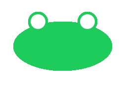

# Principio DRY

DRY = Don't Repeat Yourself.

Non eseguirai mai copia e incolla, all'interno del tuo codice.

Copia e Incolla E' Male.

--- 

# Modifichiamo lo smile poco smiling

Proviamo ad esempio ad ingrandire i suoi occhi.

Ad esempio, rendiamoli grandi 50px. Quante volte dobbiamo digitare il nuovo valore?

Più di una?

Allora il nostro codice è migliorabile.

---

# Il problema

Per disegnare gli occhi abbiamo scritto una cosa del genere:

> ellipse(150, 150, 30, 30);
> ellipse(250, 150, 30, 30);

Per modificare la dimensione degli occhi, dobbiamo inserire un valore diverso al posto di quei **30**.

L'ideale sarebbe modificare questo valore una volta sola, per evitare noia ed errori.

---

# Dare un nome ai valori

Possiamo semplificarci la vita assegnando un **nome significativo** a questo valore, utilizzandolo poi dovunque compaia il valore:

> let occhio = 30;
> ellipse(150, 150, occhio, occhio);
> ellipse(250, 150, occhio, occhio);

---

# DRY in action

Diamo un'espressione più stupita al nostro smile, assegnamo ad occhio il valore **40**

> let occhio = 40;
> ellipse(150, 150, occhio, occhio);
> ellipse(250, 150, occhio, occhio);

Quante volte abbiamo modificato il valore? Solo una.

Siamo stati molto DRY.

Ricordate: **Copia&Incolla è male**.

---

# Sfida: la rana muta

Vogliamo disegnare una rana:

Il centro della testa è in questa posizione:

> var x = 200;
> var y = 250;

*per non disegnare i bordi delle figure: noStroke()*

---

# Espressioni

Dove si trovano gli occhi?

Il sinistro 50px a sinistra del centro. Il destro 50px a destra del centro.

Possiamo calcolare la posizione degli occhi sommando e sottraendo 50 alle coordinate del centro della testa:

> let x_occhio_sx = x - 50;
> let x_occhio_dx = x + 50;
> let y_occhio_sx = y - 50;
> let y_occhio_dx = y + 50;

Abbiamo calcolato il valore di nuove variabili usando delle espressioni, combinando valori e variabili con simboli aritmetici.

--- 

# Rana muta: conclusione

Proviamo dunque a disegnare la rana muta:
- colore: (30, 204, 91)
- dimensioni della testa: 200x100
- dimensioni degli occhi: 50x50
- dimensioni delle pupille: 40x40

--- 

# Diamole voce

Aggiungiamo ora la bocca: ellisse nera, centrata sulla testa ma un po' più stretta, ad esempio 120x50.

Per disegnare l'ellisse, usiamo le variabili x e y, che già contenevano le coordinate del centro della testa.

*Qualcuno ha parlato di pupille?*