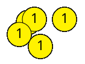

# Funzioni: creiamo nuove azioni

Fino a qui abbiamo utilizzato funzioni fornite dalla libreria P5.JS.

Queste funzioni ci hanno consentito di disegnare e colorare figure:

```js
ellipse(...)
line(...)
fill(...)
..
```

Ora impareremo a progettare noi stessi nuove funzioni.

---

# Sfida: moneta

Proviamo ora a disegnare una moneta:


:bulb: usiamo la funzione [textSize()](https://p5js.org/reference/p5/textSize/) per ingrandire il carattere
:bulb: usiamo invece [textAlign()](https://p5js.org/reference/p5/textAlign/) per allineare il numero al centro della moneta

---

# Sfida: un sacco di monete

Provate ora a diventare ricchi disegnando molte monete:



--- 

# Copia&Incolla è il male

Probabilmente qualcuno di voi ha copiato il codice per disegnare una moneta e l'ha incollato più volte, cambiando le coordinate del centro della moneta.

Questo non si fa: Copia&Incolla è male.

Abbiamo esposto però un'esigenza: eseguire un blocco di codice tante volte, **evitando copia e incolla**.

---

# Soluzione

Possiamo risolvere **assengnando un nome** al blocco di codice che disegna una moneta, usando la parola chiave di JS **function**:

```js
function moneta() 
{
  fill(255, 242, 0);
  ellipse(x_pos, y_pos, 40, 40);
  ...
}
```

---

# Dichiarare una funzione

Col termine **dichiarazione** indichiamo la creazione di una nuova funzione:

```js
function nome()
{
   <blocco di codice>
}
```

---

# Richiamare una funzione

Ora che abbiamo dichiarato la nostra funzione **moneta()**, proviamo a richiamarla nella funzione principale draw();

Cosa accade?

Un bel niente. 

Come mai?

Stiamo disegnando tante monete, ma tutte nella stessa posizione

--- 

# Pioggia di monete

Proviamo ora a impostare la posizione della moneta su coordinate casuali:

```js
function moneta() {
  let x = random(50, 350);
  let y = random(50, 350);
  ...
}
```

Ricarichiamo la pagina del browser e godiamoci la nostra pioggia di monete d'oro.

--- 

# Sfida: saluti

Il seguente codice scrive un nome nell'area di disegno:

```js
let textX = random(0, 300);
let textY = random(0, 300);
let name = "Your Name";
fill(255, 0, 0);
textSize(30);
text("Hiiii, " + name, textX, textY);
```

Sfida: prova a dare un nome a questo codice, inserendolo in una funzione **saluta()**

---

# Fila di monete

Proviamo ora a disegnare una fila di monete, richiamando più volte la funzione **moneta()**


Chiaramente questo non è possibile, dato che non abbiamo modo di decidere dove la moneta deve essere disegnata.

--- 

# Parametri

JS ci dà la possibilità di **modificare** il comportamento di una funzione, quando la chiamiamo.

Invece che calcolare la posizione di x e y in modo casuale, dobbiamo chiedere all'utente dove disegnare la moneta:

> function moneta(**x**, **y**) {   <-- parametri della funzione
> ~~let textX = random(0, 300);~~
> ~~let textY = random(0, 300);~~
> ...
> }

---

# Parametri - 2

Abbiamo definito dei **parametri** per la funzione moneta(): valori che possiamo decidere nel momento in cui chiamiamo la funzione:

> function draw() 
> {
>    moneta(50, 200);
>    moneta(100, 200);
>    moneta(150, 200);
> }

Così otteniamo una prevedibile riga di monete

---

# Sfide

## Saluti generalizzati

Modificare la funzione saluti() in modo che il nome della funzione da salutare sia passato come **parametro**

## Zecca di stato

Aggiungiamo un parametro alla funzione **moneta()**, che indichi il valore della moneta. Il valore della moneta deve essere deciso quando chiamiamo la funzione.

---

# Sfida: appoggiamo monete

P5.JS, oltre a setup() e draw(), che abbiamo imparato a conoscere molto bene, mette a disposizione varie altre funzioni utili a rendere il programma interattivo.

Ad esempio: [mouseClicked()](https://p5js.org/reference/p5/mouseClicked/) è eseguita quando un utente clicca con il mouse nella superficie di disegno.

Riempire mouseClicked():

> function mouseClicked() {
> ... TODO ...
> }

in modo che venga disegnata una moneta dove l'utente clicca col mouse. (alla posizione mouseX e mouseY);

---

# Ancora interattività

Per curiosità, vediamo quali variabili e funzioni P5.JS ci mette a disposizione per implementare elementi di interattività nei nostri disegni.

Andiamo a leggere la [documentazione ufficiale](https://p5js.org/reference/#IO).

---

# Sfida: scia di monete

Riempendo la funzione P5.JS [**mouseMoved()**](https://p5js.org/reference/p5/mouseMoved/), disegniamo monete al passaggio del mouse.

---

# Funzioni che calcolano

TODO